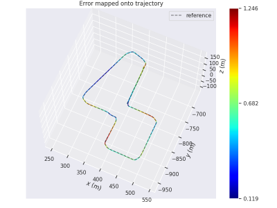

# GTAV-TeFS
## Temporal-controlled Frame Swap for Generating High-Fidelity Stereo Driving Data for Autonomy Analysis

TeFS in GTA V is a native UI-based plugin that enables stereo driving data collection in the GTA V environment. This repo produces high-resolution stereo RGB image pairs accompanied by temporal information, GPS coordinates, camera poses, and full-resolution dense depth maps(convertible to disparity map). Facilitating stereo Visual SLAM tasks, which were previously unachievable with GTA V. 
Paper Link: [https://arxiv.org/abs/2306.01704](https://arxiv.org/abs/2306.01704)


## Samples
[GTAV-TeFS sample dataset](https://coe.northeastern.edu/Research/AClab/GTAV-TeFS_z/GTAV_TeFS_Data_Sample.zip)

### Stereo output video sample
[](https://youtu.be/wBe1WyqN0EM)


### TeFS Presentation
[](https://www.youtube.com/watch?v=mIfOBIx3HwA&ab_channel=SarahOstadabbas)

Pregenerated GTAV-TeFS dataset:[City_01_Day](https://coe.northeastern.edu/Research/AClab/GTAV-TeFS/City01_Day.zip), [City_01_Night](https://coe.northeastern.edu/Research/AClab/GTAV-TeFS/City_01_Night.zip), [City02_Day](https://coe.northeastern.edu/Research/AClab/GTAV-TeFS/City02_Day.zip), [City02_Night](https://coe.northeastern.edu/Research/AClab/GTAV-TeFS/City02_Night.zip), [City03_Mix](https://coe.northeastern.edu/Research/AClab/GTAV-TeFS/City03_Mix.zip), [City05_AirportTraffic](https://coe.northeastern.edu/Research/AClab/GTAV-TeFS/City05_AirportTraffic.zip), [Offroadmix_Day](https://coe.northeastern.edu/Research/AClab/GTAV-TeFS/Offroadmix_Day.zip), [Offroadmix_Night](https://coe.northeastern.edu/Research/AClab/GTAV-TeFS/Offroadmix_Night.zip), [Comparison Group](https://coe.northeastern.edu/Research/AClab/GTAV-TeFS/Comparison.zip), 

GTAV-TeFS dataset stereo camera setup: [Stereo_Calib.txt](Stereo_Calib.txt)


## Installation

1. Ensure that your GTA V game version is 1.0.2845.0 or lower.
2. Navigate to the `TeFS/bin/Prebuild Release` folder, copy all the files inside it, and then paste them into the main directory of Grand Theft Auto V.
3. Similarly, copy all the files from the `TeFS/bin/Vision Native Prebuild Release` folder and paste them into the main directory of Grand Theft Auto V.
   - If you wish to modify the GTAVisionExport to better suit your own needs, refer to the [original post](https://github.com/umautobots/GTAVisionExport/tree/master/native) for guidance.
4. Replace your game saves located in the `Documents/Rockstar Games/GTA V/Profiles/` directory with the contents of the `bin/Save Files` directory.
5. If you prefer to remove the distortion shader that's applied to the gameplay camera, you can apply the [no-distortion mod](https://www.gta5-mods.com/misc/no-chromatic-aberration-lens-distortion-1-41).

## How to Use

### Setting up the `config.txt` file:

1. Navigate to the `config.txt` file in the scripts folder located under the main GTA V directory and open it.
2. Update the following parameters as per your requirements:
   - `[Output]`: Define your preferred output directory where the generated stereo image pairs and binary depth files will be stored.

   - `[Start Position]`: Specify the initial position of your ego vehicle.

   - `[Custom Routes]`: This allows for a multi-destination setup. You can design loop closure and complex maps using this.

   - `[Speed]`: Set the auto drive speed, measured in m/s.

   - `[Screen Resolution]`: Set the screen resolution, default is 3840*2160.

   - `[Game Resolution]`: Set the game resolution, default is 1920*1080.

   - `[Capture Offset]`: Adjust this according to the location of your game on the screen.

   - `[Camera Setup]`: Customize stereo camera parameters according to your needs.

   - `[Reduce Traffic]`: Default setting is on, change this as needed.

   - `[Store Time]`: Default at 5 Tick, increase to avoid data loss if you have an older machine.

### Stereo Data Collection using the TeFS menu:

1. After entering the story mode, press F5 to activate the TeFS menu. Use the arrow keys to navigate through the menu.
2. Choose "Teleport to Ego Vehicle". This option will teleport both the player and the ego car to the starting position that you've set up in the configuration file.
3. To start the auto-drive routes, select one of the following:
   - "Drive to Waypoint" to navigate towards your set destination marker.
   - "Auto Drive" for continuous, indefinite driving.
   - "Drive Custom Route" to traverse the custom map designed in your configuration file. This enables loop closure and allows for the creation of a multi-destination map.
4. After the auto drive starts, select "Start Stereo Collection" and close the TeFS menu using the back key.

## Process Tools

The default depth output generated is in NDC format. To convert it to the true depth map, run:

```bash
#process left and right camera respectively
python processDepth.py
```
To add timestamp to stereo images in EuRoC format, run:

```bash
python gta2timeStamp.py
python convertTS.py
```

To output the trajectory ground truth from metadata, run:

```bash
python metadata2traj.py
```


## Stereo Odometry ORB-SLAM3 Evaluation Example

1. Install [ORB-SLAM3](https://github.com/UZ-SLAMLab/ORB_SLAM3).
2. Download the processed GTA-TeFS sample [here](https://gtav-tefs.s3.amazonaws.com/orb_example.zip).
3. Unzip it to the directory of your choice.
4. Copy and paste the `GTA_1080.yaml` to the `ORB_SLAM3/Examples/Stereo` folder.
5. Go to the ORB-SLAM3 main directory, and run:

```bash
./Examples/Stereo/stereo_euroc ./Vocabulary/ORBvoc.txt ./Examples/Stereo/GTA_1080.yaml /PATH/TO/City01_Day_stamped/ /PATH/TO/City01_Day_stamped/time_cvt_orb.txt
```

In our experiment, we used the [evo package](https://github.com/MichaelGrupp/evo) for evaluation. Compare the estimated result and provided `gt.txt` using the following command:

```bash
evo_ape tum gt.txt CameraTrajectory.txt -p --align
```


## Some Potential Issues
The game clock may vary between machines. All experiments and data collection were conducted using an desktop with RTX 3090 Ti and Intel i9-12900KS. There was one observed clock difference when running the game on an older Alienware machine with an i7-9700 and an RTX 2070. The specific reason for this discrepancy is unknown. While this difference should not affect the stereo data collection, it may impact the time gap between consecutive image pairs collected.

To prevent encountering unknown issues, it is recommended to update your video card driver to the lastest version.


## Acknowledgment 

This research was sponsored by the DEVCOM Analysis Center and was accomplished under Cooperative Agreement Number W911NF-22-2-0001. The views and conclusions contained in this document are those of the authors and should not be interpreted as representing the official policies, either expressed or implied, of the Army Research Office or the U.S. Government. The U.S. Government is authorized to reproduce and distribute reprints for Government purposes notwithstanding any copyright notation herein.

## Citation
```bash
@article{Luo2023TeFS,
  title={Temporal-controlled Frame Swap for Generating High-Fidelity Stereo Driving Data for Autonomy Analysis},
  author={Luo, Yedi and Bai, Xiangyu and Jiang, Le  and Gupta,  Aniket  and
 Mortin, Eric and Singh, Hanumant and Ostadabbas, Sarah},
    journal={https://arxiv.org/pdf/2306.01704.pdf},
  year={2023}
  }
  
```